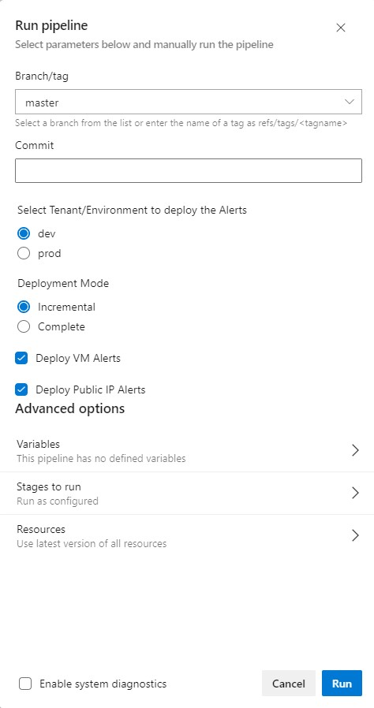

<p align="right">
 
</p>

#
# Azure Monitor Agent Deployment Pipeline

Microsoft is deprecating the Log Analitycs agent and Consolidating legacy agents, challenging to [migrate to Azure Monitor Agent](https://learn.microsoft.com/en-us/azure/azure-monitor/agents/azure-monitor-agent-migration). <br>
This Proof of Concept (PoC) demonstrates the deployment of the Azure Monitor Agent on Linux virtual machines, coupled with the configuration of data collection rules to collect valuable OS-level metrics. <br>
Additionally, it includes the deployment of alerts to illustrate their practical utilization for monitoring insights.<br><br>


## Pipeline Architecture

The pipeline is structured in two stages (Dev and Prod) and inside each stage there are job templates, one template per resource type, i.e:
- template: alerts/jobs/core.yml@self
- template: alerts/jobs/vm.yml@self
- template: alerts/jobs/pip.yml@self

<br>

The **core.yml** template deploys common resources like [`Action Group`](https://learn.microsoft.com/en-us/azure/azure-monitor/alerts/action-groups) and [`Data collection rules`](https://learn.microsoft.com/en-us/azure/azure-monitor/essentials/data-collection-rule-overview)

- `Action Groups` are integral to Azure Monitor and Management, enabling users to specify notification actions when conditions or alerts occur in Azure resources. They streamline and centralize notifications, enhancing event and incident response.
- `Data Collection Rule` is a resource that collects metrics retrieved by the Azure Monitor Agent from compute resources, forwarding them to the designated Log Analytics Workspaces for further analysis and monitoring.

<br>

The **vm.yml** template orchestrates the deployment of the [`Azure Monitor Agent`](https://learn.microsoft.com/en-us/azure/azure-monitor/agents/agents-overview) to each virtual machine, enabling System Identity, configuring Data Collection Rule Datasources and Resources for VMs, and establishing metric alerts and log alerts search rules. <br>
It focuses on OS guest insights, monitoring factors like OS disk usage in specific filesystems such as /var, /usr and /home implementing queries in Log Analitycs Workspaces using Kusto Query Language.ie:

```k
InsightsMetrics
| where Namespace == "LogicalDisk"
| where Name == "FreeSpacePercentage"
| extend logicalDisk = tostring(parse_json(Tags)['vm.azm.ms/mountId'])
| extend freeSpacePercent = Val
| where logicalDisk in ("/", "/var", "/tmp", "/usr", "/home")
| where TimeGenerated >= ago(5m)
| summarize AvgFreeSpacePercent = avg(freeSpacePercent) by logicalDisk
| project logicalDisk, AvgFreeSpacePercent
```

The **pip.yml** template deploys metric alerts using Azure native metrics.
<br>

The resource configuration, tenant/subscription information, alerts Resource Group and configuration will be read from the variables file:

- stage_dev/variables.yml for dev
- stage_prod/variables.yml for prod


## Naming Convention for Alerts
| Alert Name                                                                       | Alert Type            | Description                                                                                                                                                                                                                                                       | Threshold Example                          |
|----------------------------------------------------------------------------------|-----------------------|-------------------------------------------------------------------------------------------------------------------------------------------------------------------------------------------------------------------------------------------------------------------|--------------------------------------------|
| <tenant_name\>\_<resource_group\>\_<severity\>\_vm-du<threshold\>\_<vm-name\>    | Log Search alert Rule | This alert runs a query in the Azure table **InsightsMetrics** in Log Analytics. Workspaces and triggers a notification if the free space of logical disk is lower than the set threshold. By default this logical disk are monitored: /, /var, /tmp, /usr, /home | AvgFreeSpacePercent <= 25                  |
| <tenant\_name\>\_<resource\_group\>\_<severity\>\_vm-cpu<threshold\>\_<vm-name\> | Metric alert Rule     | This alert monitors the Azure native metric **Percentage CPU** triggers a notification if the CPU usage is greather than the set threshold.                                                                                                                       | Percentage CPU > 90                        |
| <tenant\_name\>\_<resource\_group\>\_<severity\>\_vm-mem<threshold\>\_<vm-name\> | Metric alert Rule     | This alert monitors the Azure native metric **Available Memory Bytes** triggers a notification if the fee RAM memmory is lower than the set threshold.                                                                                                            | Available Memory Bytes <= 4000000000 (4GB) |
| <tenant\_name\>\_<resource\_group\>\_<severity\>\_pip-unavailable\_<pip-name\>   | Metric alert Rule     | This alert monitors the Azure native metric **VipAvailability** triggers a notification if the PIP availability is below set threshold.                                                                                                                           | VipAvailability < 99%                      |
|                                                                                  |                       |                                                                                                                                                                                                                                                                   |                                            |

<br>

All the resources created by this pipeline, will be deployed to the resource group configured in the variables file under this key: **alertsResourceGroupName**.
The list of resources to be alerted will be  read from the variables file, following this logic:

```json
  $resourceNamedict = @{
    "vm_alert" = "node"
    "pip_alert" = "pipName"
  }
```

For **vm_alert1** for example, the pipeline will look for VMs under the key **node1**, **node2**. etc.
There is an script (alerts.ps1) run by the pipeline that will iterate through all this keys and deploy all the alerts configured in variables file.


## Alerts Configuration Definition

The following alert definition config will be used: <resourceType_alertNumber\>: <alert_type\>,<alert_desc\>,<severity\>,<threshold\>,<evaluationFrequency\>,<windowSize\>,<templatePath\>

| Alert field                 | Description                                                                                                                                                        | Values                                                                                                                                                                       |
|-----------------------------|--------------------------------------------------------------------------------------------------------------------------------------------------------------------|------------------------------------------------------------------------------------------------------------------------------------------------------------------------------|
| <resourceType_alertNumber\> | Alert Key used in the pipeline to look for alets                                                                                                                   | vm_alert<br>pip_alert                                                                                                                                                        |
| <alert_type\>               | Alert type identifier, used to trigger the right deployment logic within the pipeline                                                                              | metrics<br>logs                                                                                                                                                              |
| <alert_desc\>               | This field is not used in the pipeline, it is just a reference for the alert config itself                                                                         | Any                                                                                                                                                                          |
| <severity\>                 | Alert Severity, this value is an int and will be passed as argument to the ARM template. It will be also part of the alert name.                                   | 0 = Critital<br>1 = Error<br>2 = Warning<br>3 = Informatinal<br>4 = Verbose                                                                                                  |
| <threshold\>                | Alert Threshold, this value can be an int or float will be passed as argument to the ARM templatee. It will be also part of the aler name.                         | any unsignet int of float                                                                                                                                                    |
| <evaluationFrequency\>      | This is the cadence at which the alert condition is evaluated.                                                                                                     | PT1M = 1 minute<br>PT5M = 5 minutes<br>PT15M = 15 minutes<br>PT30M = 30 miutes<br>PT1H = 1 hour                                                                              |
| <windowSize\>               | This is the lookback period, or the time period to look back at each time the data is checked. For example, every 1 minute you’ll be looking at the past 5 minutes | PT1M = 1 minute<br>PT5M = 5 minutes<br>PT15M = 15 minutes<br>PT30M = 30 miutes<br>PT1H = 1hour<br>PT6H = 6 hours<br>PT12H = 12 hours<br>PT1D = 1 day                         |
| <templatePath\>             | This is the relative path where the template to deploy this alert is located followed by the template name (template.json for this pipeline)                       | \alerts\common<br>\alerts\public-ips<br>\alerts\virtual-machines\cpu-alert-rule<br>\alerts\virtual-machines\disk-usage-alert-rule<br>\alerts\virtual-machines\mem-alert-rule |
|                             |                                                                                                                                                                    |                                                                                                                                                                              |

<br>

Alert Configuration Examples:

- vm_alert1: 'metrics,cpu,0,90,PT5M,PT15M,\alerts\virtual-machines\cpu-alert-rule\template.json'
- vm_alert2: 'logs,du,0,20,PT5M,PT15M,\alerts\virtual-machines\disk-usage-alert-rule\template.json'

<br>

## Running the pipeline
There are a series of parameters that enable selecting to which tenant to deploy the alerts, and also to what kind of resources:

